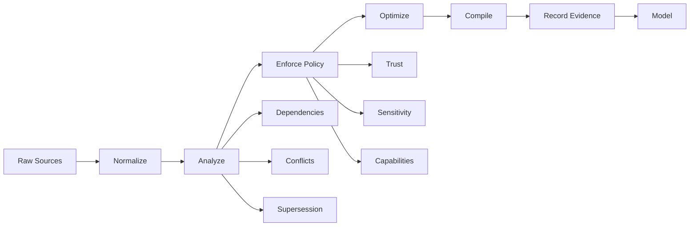
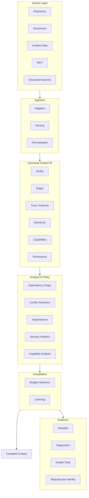
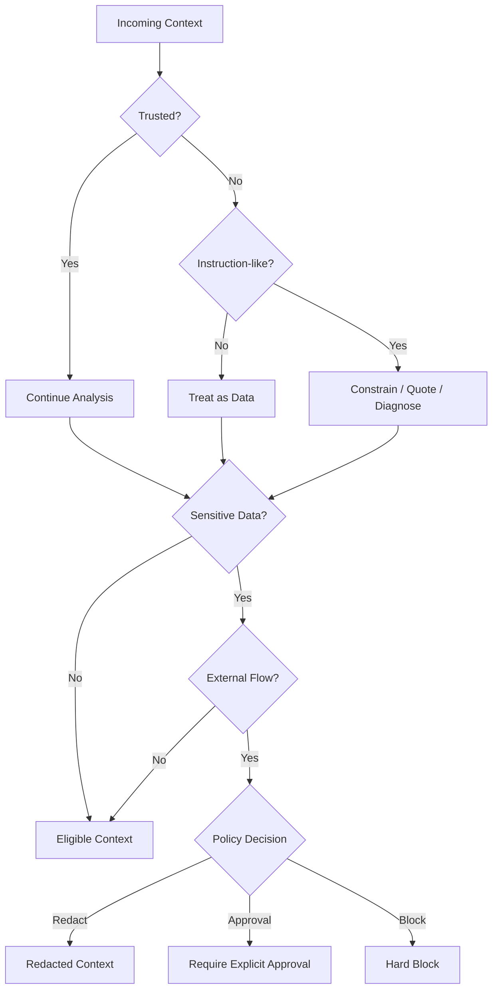
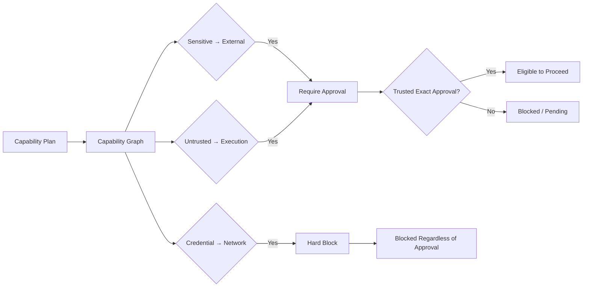
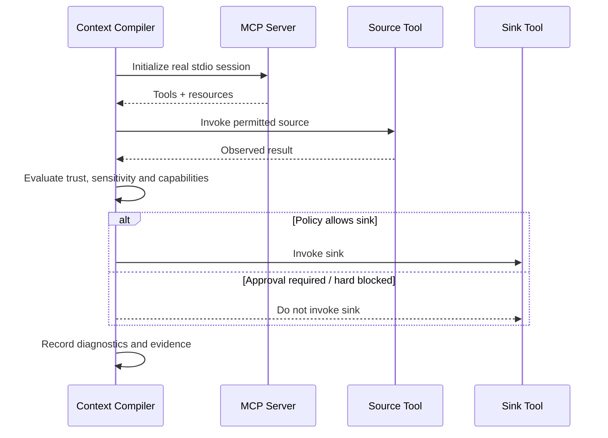
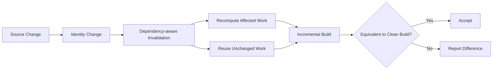
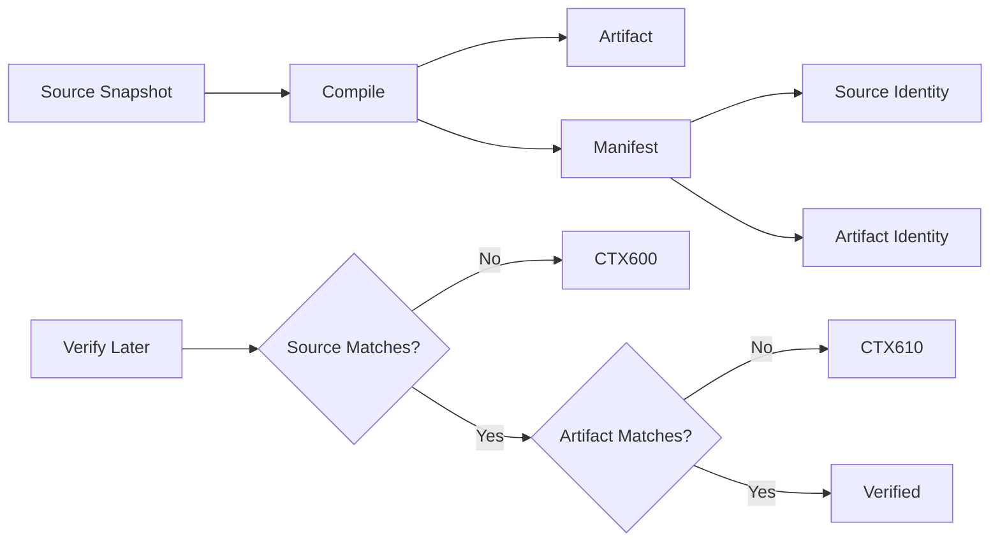

<div align="center">

# Context Compiler

### Deterministic context infrastructure for model-ready AI input

Context Compiler turns heterogeneous source material into **policy-enforced, provenance-rich, reproducible context before inference**.

<br/>


</div>

---

<!--
HERO IMAGE PLACEHOLDER

Put your generated Context Compiler image here:

  docs/assets/context-compiler-hero.png

Recommended:
- 16:9 or wide cinematic composition
- ~3840x2160 source if available
- optimized PNG/WebP for GitHub
- keep the filename/path below, or update it here if you choose another name
-->

<p align="center">
  
</p>

---

<div align="center">

## Better context in. More controlled AI out.

**Ingest · Analyze · Enforce · Compile · Trace · Reproduce**

Context Compiler adds a deterministic control layer between raw sources and model inference.

</div>

<br/>

| **INGEST** | **ANALYZE** | **ENFORCE** | **PRODUCE** |
|---|---|---|---|
| Repositories, documents, incidents, structured data, MCP | Dependencies, relevance, conflicts, supersession, capabilities | Trust, authority, sensitivity, approval, security policy | Token-bounded, model-ready context with evidence |

| **TRACE** | **EVOLVE** | **VERIFY** |
|---|---|---|
| Provenance, source identity, selection reasons | Incremental caching and dependency-aware invalidation | Reproduction identities and tamper detection |

---

## What it does

Most AI systems treat context assembly as string concatenation.

Context Compiler treats it as a **compilation problem**.

```text
heterogeneous sources
        │
        ▼
   source adapters
        │
        ▼
   canonical context IR
        │
        ├── dependency analysis
        ├── conflict detection
        ├── supersession
        ├── trust / authority
        ├── sensitivity policy
        └── capability analysis
        │
        ▼
 security + policy enforcement
        │
        ▼
 token-budget optimization
        │
        ▼
   compiled model context
        │
        ├── provenance
        ├── diagnostics
        ├── manifest
        └── reproduction evidence
        │
        ▼
      inference
```

The output is not only prompt text. It is a **compiled artifact with evidence describing how and why it was produced**.

---

## Why Context Compiler

Raw model context can contain stale guidance, conflicting evidence, irrelevant files, untrusted instructions, sensitive data, or risky tool flows.

Context Compiler moves those concerns into an explicit pre-inference layer.



---

# Core capabilities

### Provenance-aware selection
Retains source identity and selection evidence so compiled context can be traced back to its origin.

### Dependency-aware context
Tracks relationships between source nodes and can retain required implementation, test, and supporting evidence through graph closure.

### Conflict and supersession handling
Distinguishes disagreement from explicit replacement so old guidance does not silently override current evidence.

### Security policy enforcement
Evaluates trust, authority, sensitivity, and instruction-flow risks before content reaches the model.

### Static capability analysis
Analyzes resource and tool compositions before execution and distinguishes approval-required flows from hard blocks.

### Live MCP enforcement
Applies policy at the real MCP runtime boundary so prohibited sinks can be prevented from executing in validated scenarios.

### Incremental compilation
Reuses unaffected work while invalidating changed or dependency-affected stages.

### Reproduction and tamper detection
Records source and artifact identities so later verification can detect divergence.

---

# Architecture



---

# Security before inference

Context is treated as potentially hostile input.



### Security diagnostics

| Code | Meaning |
|---|---|
| `CTX400` | Injection-risk signal |
| `CTX410` | Sensitivity-policy violation |
| `CTX420` | Untrusted content entered instruction scope |
| `CTX425` | Trust / authority override |
| `CTX430` | Sensitive / secret external flow |
| `CTX440` | Dangerous capability composition |
| `CTX441` | Incomplete capability declarations |
| `CTX442` | Invalid capability plan |
| `CTX443` | Explicit approval required |
| `CTX444` | Capability policy / evidence failure |
| `CTX445` | Observed-vs-declared capability mismatch |
| `CTX600` | Manifest / source mismatch |
| `CTX610` | Reproduction artifact mismatch |

---

# Capability enforcement

Context Compiler can reason about tool plans before execution.



This distinction matters: an approval-required flow is not the same as a non-overridable hard block.

---

# Live MCP enforcement



Validated live-runtime cases include safe public reads, secret-to-message blocking, untrusted-to-execution blocking, credential-to-network hard blocking, and observed-vs-declared capability mismatch detection.

---

# Incremental compilation



The validated release demonstrated warm-cache reuse, selective invalidation, deep dependency invalidation, unchanged-source reuse, and incremental/clean-build equivalence.

---

# Reproduction



---

# Install

## Recommended: `pipx`

Download the wheel from the GitHub release, then:

```bash
pipx install ./context_compiler-0.18.0-py3-none-any.whl
contextc version
```

## With `uv`

```bash
uv tool install ./context_compiler-0.18.0-py3-none-any.whl
contextc version
```

## With `pip`

```bash
python3 -m pip install ./context_compiler-0.18.0-py3-none-any.whl
contextc version
```

Expected:

```text
0.18.0
```

> If the project is later published to PyPI as `context-compiler`, installation can use `pipx install context-compiler`, `uv tool install context-compiler`, or `python3 -m pip install context-compiler`.

---

# Quick start

Compile repository context:

```bash
contextc compile ./repo \
  --source-adapter repository \
  --task "Explain the checkout bug and retain the relevant implementation and tests" \
  --target generic \
  --token-budget 1200 \
  --output compiled-context.txt \
  --manifest compiled-context.manifest.json \
  --json > compile.json
```

Verify the result:

```bash
contextc reproduce compiled-context.manifest.json --verify --json
```

Conceptually:

```text
repo
 │
 ▼
index / parse
 │
 ▼
dependency + relevance analysis
 │
 ▼
security + supersession
 │
 ▼
budgeted selection
 │
 ▼
compiled-context.txt
+
compiled-context.manifest.json
```

---

# Validation

**v0.18.0 completed a 20-scenario end-to-end validation campaign.**

| Batch | Focus | Result |
|---|---|---:|
| 1 | Repository selection, dependencies, budget pressure, conflicts, supersession | **5/5** |
| 2 | Injection handling, sensitive flow, static capabilities, approvals | **5/5** |
| 3 | Live MCP runtime enforcement and capability mismatch | **5/5** |
| 4 | Incremental compilation, invalidation, reproduction, tamper checks, Ollama A/B | **5/5 adjudicated** |
| **Total** | **End-to-end scenarios** | **20/20** |

### B4-18 audit note

The original B4-18 acceptance harness recorded one failure because its checker required a particular non-leaf recomputation pattern.

That original failure was preserved.

A stronger predeclared adjudication changed a real deep-leaf source and verified dependency-aware invalidation, incremental/full equivalence, cache validity, unchanged-source reuse, artifact change, and certified-source immutability. The adjudication passed.

---

# Local-model A/B

The final local-model test used the same `llama3.2:3b` model, question, temperature `0`, seed `42`, and essentially the same prompt-token budget.

| Path | Prompt tokens | Checklist |
|---|---:|---:|
| Raw context | 1468 | **7/7** |
| Context Compiler | 1472 | **7/7** |

The Context Compiler path additionally provided pre-inference security policy enforcement, supersession handling, provenance, and reproduction evidence.

This single run does **not** establish model-accuracy, latency, or cost superiority.

---

# Documentation

| Guide | Link |
|---|---|
| Installation | [docs/INSTALLATION.md](docs/INSTALLATION.md) |
| Quickstart | [docs/QUICKSTART.md](docs/QUICKSTART.md) |
| Architecture | [docs/ARCHITECTURE.md](docs/ARCHITECTURE.md) |
| CLI reference | [docs/CLI_REFERENCE.md](docs/CLI_REFERENCE.md) |
| Security model | [docs/SECURITY_MODEL.md](docs/SECURITY_MODEL.md) |
| MCP & capability enforcement | [docs/MCP.md](docs/MCP.md) |
| Incremental cache | [docs/INCREMENTAL_CACHE.md](docs/INCREMENTAL_CACHE.md) |
| Reproduction | [docs/REPRODUCTION.md](docs/REPRODUCTION.md) |
| Validation | [docs/VALIDATION.md](docs/VALIDATION.md) |
| Operations | [docs/OPERATIONS.md](docs/OPERATIONS.md) |
| Packaging & release | [docs/PACKAGING_RELEASE.md](docs/PACKAGING_RELEASE.md) |
| Release checklist | [docs/GITHUB_RELEASE_CHECKLIST.md](docs/GITHUB_RELEASE_CHECKLIST.md) |
| Troubleshooting | [docs/TROUBLESHOOTING.md](docs/TROUBLESHOOTING.md) |
| Glossary | [docs/GLOSSARY.md](docs/GLOSSARY.md) |

Contributing information is available in [`CONTRIBUTING.md`](CONTRIBUTING.md).

---

# Distribution

Certified v0.18.0 artifacts:

```text
Wheel
context_compiler-0.18.0-py3-none-any.whl
SHA-256
dcee2e233f6ea16101581815a3a634ae6eddb56589783908cc6d1bc9dc678ed3

Source distribution
context_compiler-0.18.0.tar.gz
SHA-256
b3835de6c5ca2045475630c3f4130d14d88fd3462809e3ee954341fc8caff2ea

Clean source archive
context-compiler-m16-v0.18.0-FINAL.zip
SHA-256
da73bceb14c265097e8d622af58e8164a77800ae1fe34003aa0efa56f0327f15

uv.lock
SHA-256
f0635e6673fbf46c3ae67792f65c627c54afb81f5c2f59d9c87fceb8db5b91bd
```

The certified wheel was also installed in a fresh Python 3.11 virtual environment and the release smoke test passed.

---

# Release status

> **Context Compiler v0.18.0 is a production-oriented, end-to-end validated compiler prototype/release candidate that deterministically selects, transforms, secures, and records context before inference, with provenance, supersession, security policy, capability analysis, incremental caching, and reproduction evidence.**

### Demonstrated in v0.18.0

- deterministic context construction
- provenance-aware evidence selection
- dependency-aware context retention
- conflict and supersession handling
- security policy enforcement before inference
- static capability-flow analysis
- live MCP pre-sink enforcement in validated scenarios
- runtime declaration mismatch detection
- incremental caching and invalidation
- clean-build equivalence
- deterministic reproduction
- source and artifact tamper detection

### Not established by this release alone

- universal production readiness
- universal MCP interoperability
- broad multi-OS certification
- fuzz robustness
- long-duration soak/stress guarantees
- crash-recovery guarantees
- comprehensive dependency/security scanning
- model-accuracy superiority
- latency superiority
- cost superiority

---

<div align="center">

### The prompt boundary is a compilation boundary.

**Context Compiler v0.18.0**  
Local-first · Policy-driven · Model-agnostic · Reproducible

</div>
