# Context Compiler v0.18.0

> Deterministic, policy-enforced, provenance-rich context compilation for AI systems — before inference.

Context Compiler turns heterogeneous source material into a controlled model-input artifact with explicit provenance, security policy, supersession handling, capability analysis, incremental caching, and reproducibility evidence.

<p align="center">
  <strong>Source material → normalize → analyze → secure → optimize → compile → verify → inference</strong>
</p>

---

## Status

**Release status:** production-oriented, end-to-end validated release candidate.

The v0.18.0 validation campaign covered **20 scenarios** across:

- repository context selection
- dependency handling
- conflict and supersession
- security policy enforcement
- static capability analysis
- live MCP enforcement
- incremental caching
- reproduction and tamper detection
- local-model A/B evaluation

One original B4-18 harness assertion was preserved as a failure and then adjudicated with a stronger real leaf-content mutation test; the adjudication passed.

> This does **not** establish universal production readiness across all operating systems, all MCP servers, fuzz/stress conditions, crash recovery, or every dependency ecosystem.

---

## Why Context Compiler

Large-model workflows often fail before inference begins: too much context, stale guidance, untrusted instructions, conflicting evidence, hidden provenance, or risky tool compositions can all enter the prompt unchecked.

Context Compiler moves those concerns into a deterministic compilation layer.

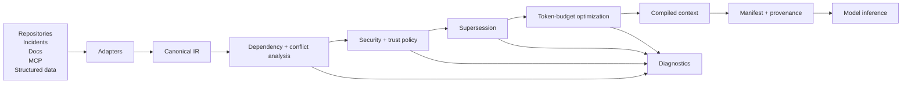

The result is not just text. It is a **compiled artifact plus evidence describing how that artifact was produced**.

---

## Core idea

```text
Raw context
   |
   v
[ Source adapters ]
   |
   v
[ Canonical intermediate representation ]
   |
   +--> dependency graph
   +--> trust / authority metadata
   +--> sensitivity labels
   +--> supersession relationships
   +--> capability declarations
   |
   v
[ Policy + optimization pipeline ]
   |
   v
Compiled model input
   |
   +--> provenance
   +--> diagnostics
   +--> security transformations
   +--> reproduction manifest
```

---

## Installation

### Recommended: `pipx` from the release wheel

```bash
pipx install ./context_compiler-0.18.0-py3-none-any.whl
contextc version
```

### With `uv`

```bash
uv tool install ./context_compiler-0.18.0-py3-none-any.whl
contextc version
```

### With `pip`

```bash
python3 -m pip install ./context_compiler-0.18.0-py3-none-any.whl
contextc version
```

Expected:

```text
0.18.0
```

If the package is later published to PyPI as `context-compiler`:

```bash
pipx install context-compiler
# or
uv tool install context-compiler
# or
python3 -m pip install context-compiler
```

---

## Quick start

Compile a repository into a bounded context artifact:

```bash
contextc compile ./repo \
  --source-adapter repository \
  --task "Explain the checkout bug and retain the relevant implementation and tests" \
  --target generic \
  --token-budget 1200 \
  --output compiled-context.txt \
  --manifest compiled-context.manifest.json \
  --json > compile.json
```

Verify the produced artifact:

```bash
contextc reproduce compiled-context.manifest.json --verify --json
```

At a high level:

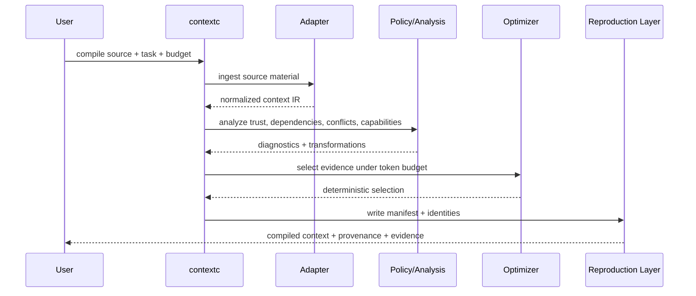

---

# Architecture

## High-level architecture

```mermaid
flowchart TB
    subgraph Inputs
        R[Repository]
        I[Incident bundle]
        M[MCP server]
        D[Documents]
        S[Structured records]
    end

    subgraph Frontend["Ingestion / Frontend"]
        A1[Source adapters]
        A2[Parsing]
        A3[Normalization]
    end

    subgraph IR["Canonical Context IR"]
        N[Nodes]
        E[Edges]
        T[Trust domains]
        X[Sensitivity]
        C[Capabilities]
        P[Provenance]
    end

    subgraph Analysis
        G[Dependency graph]
        F[Conflict detection]
        U[Supersession]
        Q[Security analysis]
        K[Capability analysis]
    end

    subgraph Compile
        O[Token-budget optimizer]
        L[Lowering]
    end

    subgraph Evidence
        M1[Manifest]
        D1[Diagnostics]
        R1[Reproduction identity]
        A1E[Audit / explain data]
    end

    Inputs --> Frontend
    Frontend --> IR
    IR --> Analysis
    Analysis --> Compile
    Compile --> Evidence
    Evidence --> OUT[Compiled model input]
```

### Design principle

The compiler separates:

1. **what sources say**
2. **which sources are trusted**
3. **which sources are authoritative**
4. **which evidence is relevant**
5. **which instructions are allowed to influence execution**
6. **which context fits within the model budget**
7. **how the final artifact can be reproduced**

That separation is the foundation for deterministic and inspectable model context.

---

# Security model

Context Compiler treats context as potentially hostile input.

The security layer reasons about:

- trust domain
- instruction authority
- sensitivity
- source-to-sink flow
- capability composition
- declared vs observed behavior
- explicit approval requirements

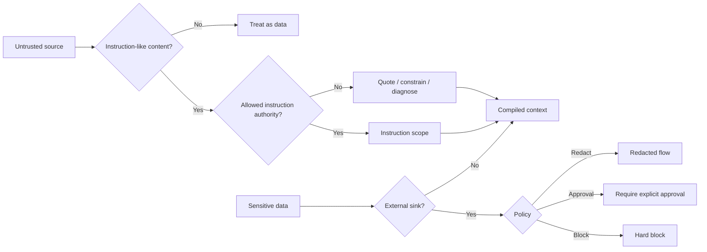

## Security diagnostics

The validated release uses diagnostics including:

| Diagnostic | Meaning |
|---|---|
| `CTX400` | Injection-risk signal |
| `CTX410` | Sensitivity-policy violation |
| `CTX420` | Untrusted content entered instruction scope |
| `CTX425` | Trust / authority override |
| `CTX430` | Sensitive / secret external flow |
| `CTX440` | Dangerous capability composition |
| `CTX441` | Incomplete capability declarations |
| `CTX442` | Invalid capability plan |
| `CTX443` | Explicit approval required |
| `CTX444` | Capability policy / evidence failure |
| `CTX445` | Observed-vs-declared capability mismatch |
| `CTX600` | Manifest/source mismatch |
| `CTX610` | Artifact reproduction mismatch |

---

# Supersession and stale guidance

Context Compiler can retain both old and new evidence while modeling which guidance supersedes which.

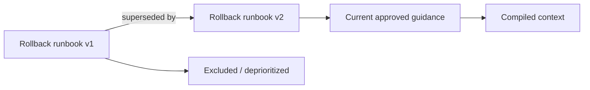

This allows the compiler to distinguish:

- contradiction
- stale guidance
- explicit supersession
- current approved evidence

without silently deleting history.

---

# Capability analysis

Context Compiler can analyze tool and resource plans before execution.

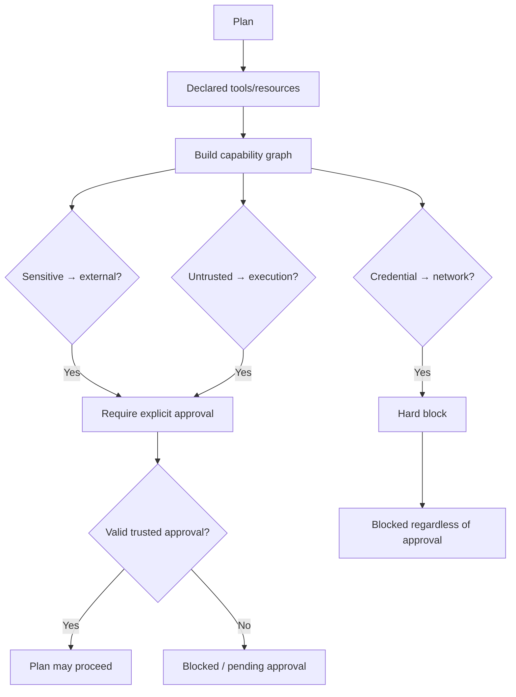

A key distinction is that **approval-required flows and hard-blocked flows are different policy outcomes**.

---

# Live MCP enforcement

The live MCP path validates that policy decisions survive contact with a real tool runtime.

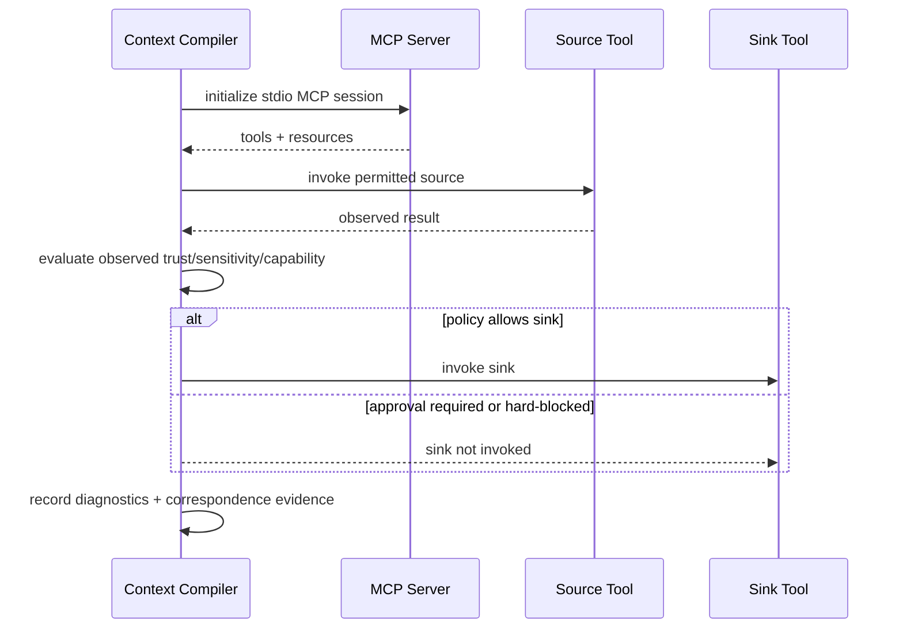

Validated behaviors include:

- safe public reads
- secret-to-external-message pre-sink blocking
- untrusted-text-to-execution pre-sink blocking
- credential-to-network hard blocking
- declared-vs-observed capability mismatch detection

---

# Incremental compilation

The incremental cache avoids recomputing unchanged work while retaining clean-build equivalence.

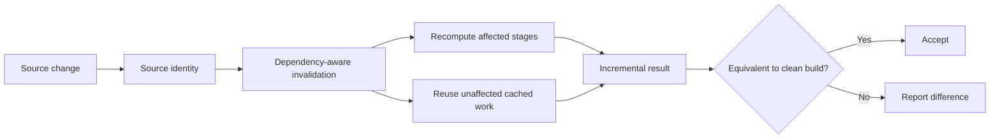

Validated incremental behaviors include:

- warm-cache reuse
- one-source selective invalidation
- dependency-aware invalidation
- unchanged source reuse
- byte-equivalent incremental vs clean output

---

# Reproduction and tamper detection

Every compiled artifact can be associated with a manifest and content identities.

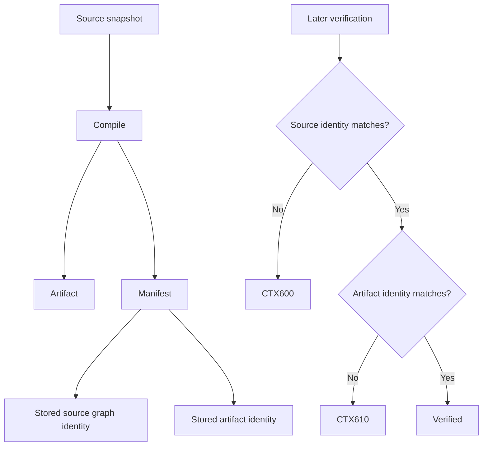

This gives the system a concrete answer to:

> “Is this still the same source and the same compiled artifact?”

---

# Evidence and provenance

A compiled result should be inspectable, not opaque.

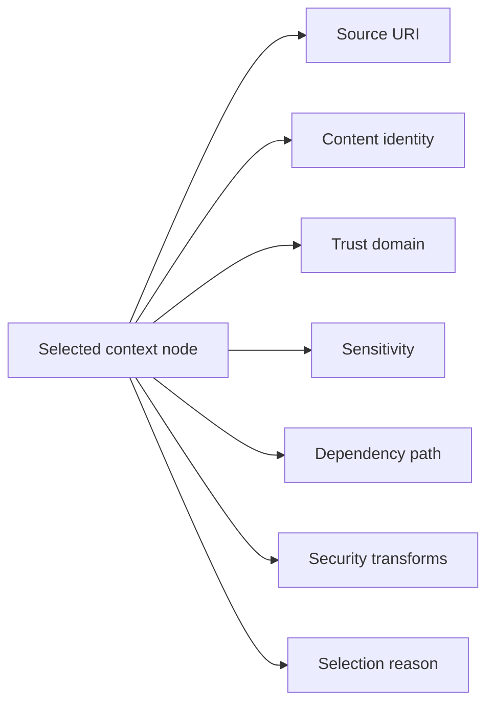

The compiler can therefore answer questions such as:

- Where did this context come from?
- Why was it selected?
- Which dependency forced it into the result?
- Was it transformed by security policy?
- Was another source superseded?
- Which source-to-sink flow triggered a diagnostic?

---

# Validation

v0.18.0 completed a 20-scenario validation campaign.

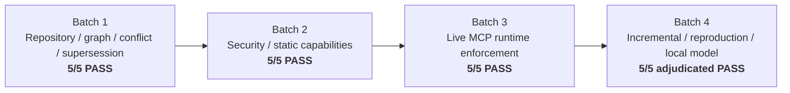

| Batch | Coverage | Result |
|---|---|---:|
| Batch 1 | repository selection, dependency chains, budget pressure, conflicts, supersession | **5/5** |
| Batch 2 | prompt injection, sensitive flow, capability composition, approval policy | **5/5** |
| Batch 3 | live MCP, pre-sink blocking, hard-block enforcement, runtime mismatch | **5/5** |
| Batch 4 | incremental reuse, invalidation, reproduction, tamper detection, Ollama A/B | **5/5 adjudicated** |
| **Total** | **20 end-to-end scenarios** | **20/20** |

### B4-18 adjudication note

The original B4-18 acceptance harness required a particular non-leaf `token_count` or `analysis` recomputation and therefore recorded an initial failure.

That failure was preserved.

A stronger predeclared V2 test then changed the deepest dependency for real and verified:

- dependency-aware invalidation closure
- leaf recomputation
- dependency-sensitive global recomputation
- unchanged-source reuse
- incremental/full equivalence
- byte-identical incremental vs clean build
- changed artifact different from original
- structurally valid cache
- certified source immutability

The adjudication passed.

---

# Local model A/B

The final validation used the same local `llama3.2:3b` model, same question, temperature `0`, seed `42`, and essentially equal prompt-token pressure.

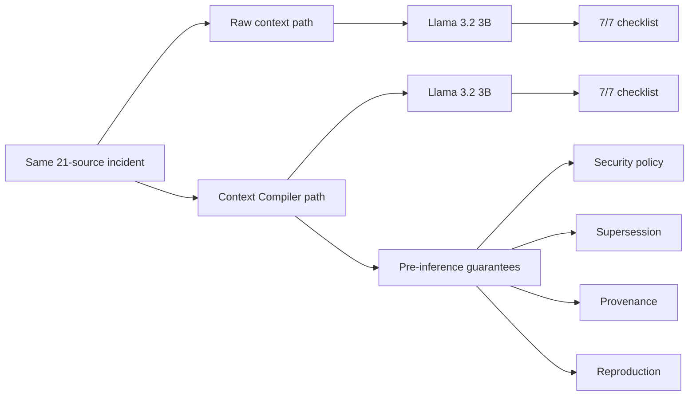

Observed prompt counts in the final run:

| Path | Prompt tokens | Checklist |
|---|---:|---:|
| Raw context | 1468 | 7/7 |
| Context Compiler | 1472 | 7/7 |

This run does **not** establish model accuracy, latency, or cost superiority. It demonstrates that the Context Compiler path can preserve task performance while adding deterministic pre-inference evidence and policy controls.

---

# CLI workflow map

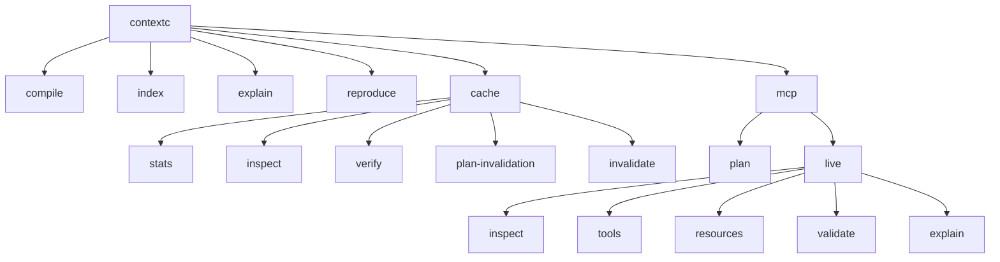

For full commands, see [CLI Reference](docs/CLI_REFERENCE.md).

---

# Repository layout

```text
context-compiler/
├── README.md
├── LICENSE
├── CHANGELOG.md
├── CONTRIBUTING.md
├── SECURITY.md
├── pyproject.toml
├── uv.lock
├── .github/
├── contextc/
├── tests/
├── examples/
├── tools/
└── docs/
```

The installable release artifacts belong in the GitHub Release, not in the normal source tree.

---

# Documentation

| Topic | Document |
|---|---|
| Installation | [docs/INSTALLATION.md](docs/INSTALLATION.md) |
| Quickstart | [docs/QUICKSTART.md](docs/QUICKSTART.md) |
| Architecture | [docs/ARCHITECTURE.md](docs/ARCHITECTURE.md) |
| CLI reference | [docs/CLI_REFERENCE.md](docs/CLI_REFERENCE.md) |
| Security model | [docs/SECURITY_MODEL.md](docs/SECURITY_MODEL.md) |
| MCP and capability enforcement | [docs/MCP.md](docs/MCP.md) |
| Incremental cache | [docs/INCREMENTAL_CACHE.md](docs/INCREMENTAL_CACHE.md) |
| Reproduction | [docs/REPRODUCTION.md](docs/REPRODUCTION.md) |
| Validation | [docs/VALIDATION.md](docs/VALIDATION.md) |
| Operations | [docs/OPERATIONS.md](docs/OPERATIONS.md) |
| Packaging / release | [docs/PACKAGING_RELEASE.md](docs/PACKAGING_RELEASE.md) |
| GitHub release checklist | [docs/GITHUB_RELEASE_CHECKLIST.md](docs/GITHUB_RELEASE_CHECKLIST.md) |
| Troubleshooting | [docs/TROUBLESHOOTING.md](docs/TROUBLESHOOTING.md) |
| Contributing | [docs/CONTRIBUTING.md](docs/CONTRIBUTING.md) |
| Glossary | [docs/GLOSSARY.md](docs/GLOSSARY.md) |

---

# Distribution artifacts

Certified v0.18.0 artifacts:

```text
Wheel
context_compiler-0.18.0-py3-none-any.whl
SHA-256
dcee2e233f6ea16101581815a3a634ae6eddb56589783908cc6d1bc9dc678ed3

Source distribution
context_compiler-0.18.0.tar.gz
SHA-256
b3835de6c5ca2045475630c3f4130d14d88fd3462809e3ee954341fc8caff2ea

Clean source archive
context-compiler-m16-v0.18.0-FINAL.zip
SHA-256
da73bceb14c265097e8d622af58e8164a77800ae1fe34003aa0efa56f0327f15

uv.lock
SHA-256
f0635e6673fbf46c3ae67792f65c627c54afb81f5c2f59d9c87fceb8db5b91bd
```

The release wheel was also smoke-tested from a fresh virtual environment and reported:

```text
Name: context-compiler
Version: 0.18.0
```

with:

```text
CERTIFIED WHEEL INSTALL SMOKE TEST: PASS
```

---

# What v0.18.0 establishes

The validated evidence supports the following positioning:

> **Context Compiler is a production-oriented, end-to-end validated compiler prototype/release candidate that deterministically selects, transforms, secures, and records context before inference, with provenance, supersession, security policy, capability analysis, incremental caching, and reproduction evidence.**

It is appropriate to claim that v0.18.0 demonstrates:

- deterministic context construction
- provenance-aware evidence selection
- security policy enforcement before inference
- static capability-flow analysis
- live MCP pre-sink enforcement in the tested scenarios
- declared-vs-observed capability mismatch detection
- incremental caching with clean-build equivalence
- dependency-aware invalidation
- deterministic reproduction
- source and artifact tamper detection

It is **not** appropriate to infer from this release alone:

- universal production readiness
- universal MCP interoperability
- cross-platform certification
- fuzz robustness
- long-duration soak/stress guarantees
- crash-recovery guarantees
- model-accuracy superiority
- latency superiority
- cost superiority

---

# Release philosophy

Context Compiler treats the prompt boundary as a compilation boundary.

Instead of sending raw heterogeneous information directly to a model:

```text
sources ------------------------------------> model
```

the system introduces an explicit control layer:

```text
sources
   |
   v
normalize
   |
   v
analyze
   |
   v
apply trust + security policy
   |
   v
resolve supersession + dependencies
   |
   v
optimize under budget
   |
   v
record provenance + reproduction evidence
   |
   v
model
```

That is the central idea behind the project.

---

## Release

**Version:** `0.18.0`  
**CLI:** `contextc`  
**Package:** `context-compiler`  
**Status:** production-oriented, end-to-end validated release candidate
