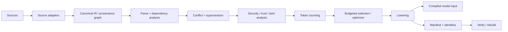
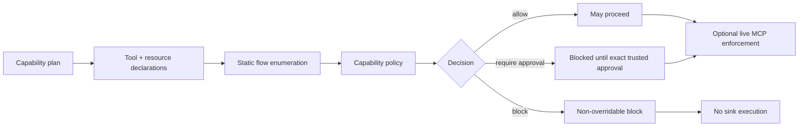

# Architecture

## Overview

Context Compiler is designed as a pre-inference compiler. Instead of handing raw heterogeneous context directly to a model, it builds an inspectable intermediate representation, applies policy and graph-aware transformations, selects evidence under a budget, and emits a deterministic model-input artifact plus a reproduction manifest.

A parallel capability-analysis path evaluates planned tool compositions before live execution:

## Core design principles

### Determinism

Inputs, policy, budget, and compilation settings are recorded so the output can be verified or rebuilt later. Deterministic identities are used throughout the evidence model.

### Provenance first

Selected context is not treated as anonymous text. It carries source identity, provenance, trust, sensitivity, and graph relationships so later stages can explain where an item came from and why it was included.

### Policy before inference

Security handling occurs before the final model input is emitted. This is important because untrusted content can be quoted as data, sensitive content can be redacted, and prohibited capability paths can be blocked before a tool sink is invoked.

### Budgeted evidence selection

The compiler can select evidence under a configured token budget while respecting graph/dependency constraints. Depending on the scenario, the optimizer may use exact optimization or a deterministic fallback heuristic.

### Reproducibility

The final artifact and source graph are connected to a manifest so later verification can detect both source drift and artifact tampering.

## Observed implementation areas

The following implementation paths were directly observed in the certified v0.18.0 tree or validation output:

- `contextc/cli/main.py` — command-line routing
- `contextc/ir.py` — trust/sensitivity domains used by capability/security logic
- `contextc/capabilities/` — capability models, policies, approvals, analysis and service layer
- `contextc/cache/` — cache service and dependency-aware invalidation
- `contextc/incremental/` — incremental service integration
- `contextc/resources/capabilities/default_capability_policy.yaml` — default capability policy
- `contextc/demos/live_mcp/tiny_server.py` — bounded local live-MCP fixture
- `contextc/resources/release_demos/` — packaged release demos
- `tests/` — regression and acceptance coverage

This document describes the validated architecture. It intentionally avoids inventing unverified internal module names for subsystems whose exact filenames were not part of the captured evidence.

## Compilation stages

### Source adapters

Adapters normalize different source types into a compiler-friendly representation. Validated workflows include repository and incident inputs, plus MCP-derived content and capability declarations.

### IR and graph construction

The compiler records nodes and relationships such as provenance and dependencies. This graph is used for evidence retention, dependency-forced selection, supersession, invalidation and explanation.

### Conflict and supersession

Conflicting evidence is preserved rather than silently reconciled. Explicit supersession can remove stale guidance from the final output while retaining diagnostics and provenance evidence.

### Security analysis

Security policy evaluates trust boundaries, instruction-like content, authority claims, sensitive flows and capability risks. Transformations can include quoting untrusted instruction-like content as data or redacting sensitive content.

### Token accounting and optimization

Candidate evidence is costed against a configured token budget. Selection is performed deterministically, using exact optimization where available/appropriate and deterministic graph-aware fallback when needed.

### Lowering

Selected, transformed evidence is lowered into the final model-input representation.

### Manifest generation

The manifest records enough source/artifact identity and build information to support later verification and rebuild.

## Static capability analysis

A capability plan describes calls and bindings. Tool declarations describe capabilities such as local file read, external write, message send, credential access and network send. The analyzer enumerates risky flows and evaluates them against capability policy.

Validated default policy distinctions include:

- `sensitive_to_external` → `require_explicit_approval`
- `untrusted_to_execution` → `require_explicit_approval`
- `credential_to_network` → `block`

Approval is scoped to an exact flow identity and trusted approver domain.

## Live MCP enforcement

The live path initializes an actual local stdio MCP server, discovers tools/resources, then applies policy before dangerous sinks. Validation demonstrated safe public reads, approval-gated external-message flow, approval-gated execution flow, credential-to-network hard block, and observed-vs-declared capability mismatch detection.

## Incremental architecture

The cache stores canonical stage results and a dependency index. Source-based invalidation identifies root cache keys and a transitive affected closure. Rebuilds recompute affected/global dependency-sensitive stages while reusing unaffected source work. Correctness is checked through incremental/full equivalence.

## Reproduction architecture

A manifest connects:

- source graph identity
- node content identities
- artifact content identity
- build/reproduction metadata

Verification can fail if the source changes (`CTX600`) or if the artifact changes (`CTX610`).
